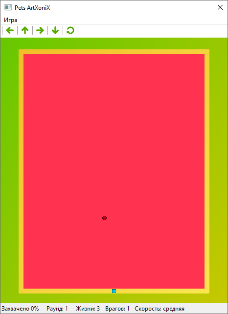
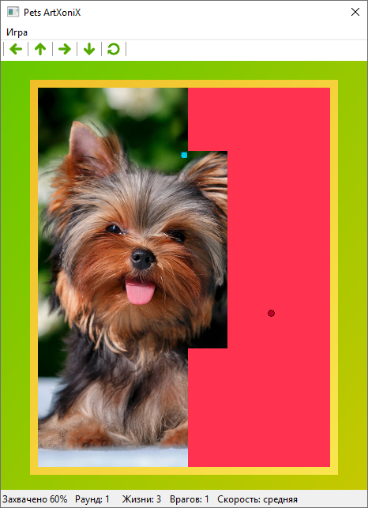
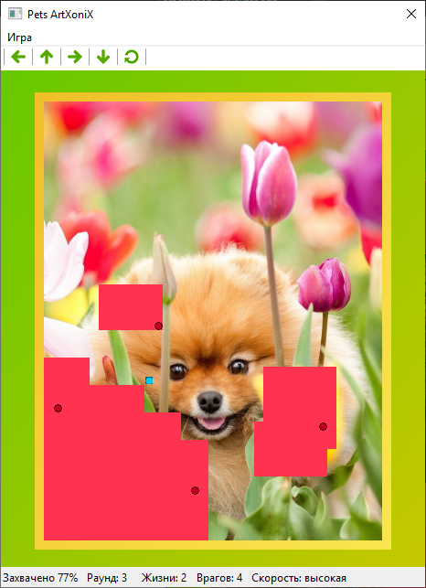
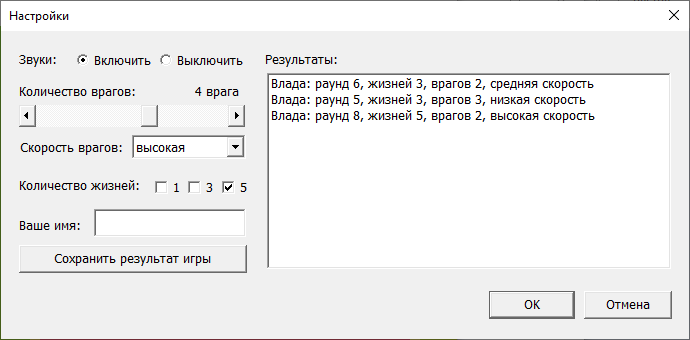

# PetsArtXoniX
Программа представляет собой одну из версий известной аркадной игры «Pets ArtXoniX».

После запуска программы пользователь попадает в главное окно приложения, в котором отображено игровое поле, панель инструментов с кнопками управления, строка состояния, в котором выводится текущей результат и настройки игры, и меню. В нём можно выбрать пункт «Настройки» и задать количество вражеских кругов на поле, скорость всех шариков, количество жизней, включить или отключить звуки в игре, сохранить результат, указав имя игрока, и просмотреть раннее сохранённые результаты.

## Описание игры

Игровое поле после начала игры залито одним цветом. По ней движется управляемый игроком шарик и управляемые программой вражеские круги. Шарик игрока может двигаться только по горизонтали и вертикали. Управлять направлением его движения можно с помощью стрелок на клавиатуре или с помощью кнопок на панели инструментов. Для захвата области шарик должен пройти по изображению такой путь, который бы образовал с ранее захваченными областями замкнутую территорию. На захваченных таким образом частях игроку будет открываться спрятанная под полем картинка. Враги двигаются в разных направлениях и мешают шарику захватывать области. Выходя на незахваченную территорию, шарик оставляет за собой след, уязвимый для врагов и для себя же самого. При попадании на врагов или свой след шарик теряет одну жизнь.

В процессе игры захваченных частей становится всё больше и заполняемое одним цветом пространство превращается в яркую цветную картинку. Необходимо захватить 80% поля, чтобы открыть картинку целиком и перейти на следующий раунд. В новом раунде всё начинается заново: поле залито одним цветом, но под ним скрывается уже другая картинка. Жизни от раунда к раунду не восстанавливаются. После потери всех жизней игра начинается заново.

**Проходите всё больше раундов, соревнуйтесь с друзьями, сохраняя свои результаты, и открывайте всё больше картинок животных.**

